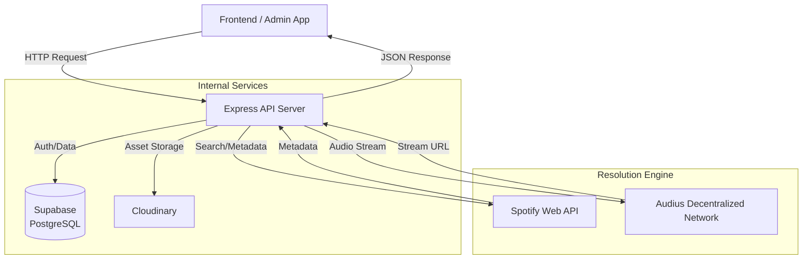

# StreamLite - Backend API 🎧

The **StreamLite Backend** is the high-performance central nervous system of the StreamLite platform. Built on **Node.js** and **Express**, it orchestrates the complex interaction between the user's local library, the **Suzuki** (Supabase) database, and decentralized external music networks.

> **Status:** 🟢 Active | **Version:** 1.0.0 | **Port:** 3000

---

## � Table of Contents
1.  [System Architecture](#-system-architecture)
2.  [Key Features & Logic](#-key-features--logic)
3.  [Technology Stack Deep Dive](#-technology-stack-deep-dive)
4.  [API Reference (Detailed)](#-api-reference-detailed)
5.  [Database Schema](#-database-schema)
6.  [Setup & Installation](#-setup--installation)
7.  [Troubleshooting](#-troubleshooting)

---

## 🏗 System Architecture

The backend operates on a **Hybrid Resolution Model**. It does not merely host files; it intelligently "resolves" metadata into playable streams.

### Architecture Diagram



---

## 🧠 Key Features & Logic

### 1. The "Resolution Engine" (`/api/resolve`)
This is the core innovation of StreamLite.
*   **Problem:** Spotify provides great metadata but 30s previews. Audius provides full streams but harder discovery.
*   **Solution:**
    1.  Frontend sends: `{ title: "Shape of You", artist: "Ed Sheeran" }` (from Spotify).
    2.  Backend normalizes text (lowercase, remove special chars).
    3.  Backend queries **Audius API** for tracks matching query.
    4.  Fuzzy matching logic scores results to find the best candidate.
    5.  Returns a direct `.mp3` stream URL to the frontend.

### 2. Dual-Layer Authentication
*   **User Auth:** Standard JWT flow for public users.
*   **Admin Auth:** Separate login flow. Admins have elevated privileges (CRUD on global library).
    *   *Security:* Passwords are hashed using `bcrypt` (Salt rounds: 10).

### 3. Unified Search Aggregator
The `/api/search` endpoint executes parallel promises:
*   `Promise 1`: Search local Supabase database (Admin uploads).
*   `Promise 2`: Search Spotify API (Network results).
*   **Result:** Responses are merged, tagged with `source: 'local'` or `source: 'spotify'`, and sorted by relevance.

---

## � Technology Stack Deep Dive

| Component | Technology | Reasoning |
| :--- | :--- | :--- |
| **Runtime** | Node.js (v18+) | Non-blocking I/O ideal for API plumbing. |
| **Framework** | Express.js | Minimalist, unopinionated routing. |
| **Database** | Supabase (PostgreSQL) | Relational integrity + Real-time capabilities. |
| **Storage** | Cloudinary | CDN-optimized delivery for user uploads. |
| **Music API** | Spotify Web API | Industry-standard metadata provider. |
| **Auth** | JSON Web Tokens (JWT) | Stateless authentication scaling. |

---

## � API Reference (Detailed)

### 🔐 Authentication

#### **Login User**
*   **Endpoint:** `POST /api/user/login`
*   **Body:**
    ```json
    {
      "email": "user@example.com",
      "password": "securePassword123"
    }
    ```
*   **Response (200 OK):**
    ```json
    {
      "message": "Login successful",
      "token": "ey...[JWT_STRING]...",
      "user": { "id": 1, "name": "John Doe", "email": "..." }
    }
    ```

### 🎵 Tracks & Playback

#### **Resolve Stream**
*   **Endpoint:** `POST /api/resolve`
*   **Body:**
    ```json
    {
      "title": "Song Title",
      "artist": "Artist Name",
      "duration": 300 (Optional hint)
    }
    ```
*   **Response:**
    *   Success (200): `{ "audio_url": "https://discoveryprovider.audius.co/..." }`
    *   Not Found (200 but handled): `{ "error": "Track not found" }`

#### **Search Global**
*   **Endpoint:** `GET /api/search`
*   **Query Params:** `?q=imagine+dragons`
*   **Response:**
    ```json
    [
      { "id": "sp_123", "title": "Believer", "source": "spotify", ... },
      { "id": 5, "title": "Local Indie Track", "source": "local", ... }
    ]
    ```

### 👑 Admin Management

#### **Upload Track**
*   **Endpoint:** `POST /api/admin/tracks`
*   **Headers:** `Authorization: Bearer <ADMIN_TOKEN>`
*   **Content-Type:** `multipart/form-data`
*   **Fields:** `title`, `artist`, `image` (file), `song` (file).

---

## � Database Schema

The generic schema concept used in Supabase:

*   **`users`**: `id` (UUID), `email` (Unique), `password_hash`, `role` (user/admin).
*   **`songs`**: `id`, `title`, `artist`, `album`, `image_url` (Cloudinary), `song_url` (Cloudinary), `duration`.
*   **`podcasts`**: `id`, `title`, `publisher`, `description`, `image_url`.
*   **`episodes`**: `id`, `podcast_id` (FK), `title`, `audio_url`, `duration`.

---

## � Setup & Installation

1.  **Clone & Install**
    ```bash
    cd backend
    npm install
    ```

2.  **Environment Configuration**
    Ensure your `.env` file (not committed to repo) has:
    *   `SUPABASE_URL` / `SUPABASE_KEY`
    *   `SPOTIFY_CLIENT_ID` / `SPOTIFY_CLIENT_SECRET`
    *   `AUDIUS_BASE_URL`

3.  **Start Services**
    ```bash
    # Development Mode (Nodemon)
    npm run dev
    
    # Production Mode
    npm start
    ```

---

## 🔧 Troubleshooting

*   **Error: `Spotify Authorization Failed`**
    *   *Cause:* Client ID/Secret incorrect or expired token.
    *   *Fix:* Check `.env` and restart server.
*   **Error: `Resolution 404`**
    *   *Cause:* Audius API could not find the track.
    *   *Fix:* Frontend will auto-fallback. Check logic in `resolveController.js` fuzzy matching strictness.
*   **Error: `CORS Policy Blocked`**
    *   *Cause:* Frontend running on unauthorized port.
    *   *Fix:* Add origin to `cors()` config in `index.js`.
